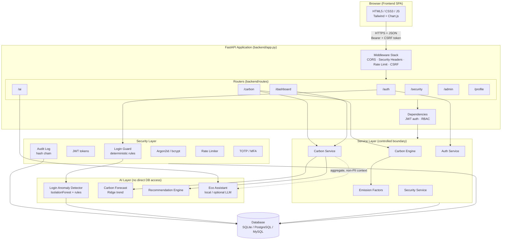
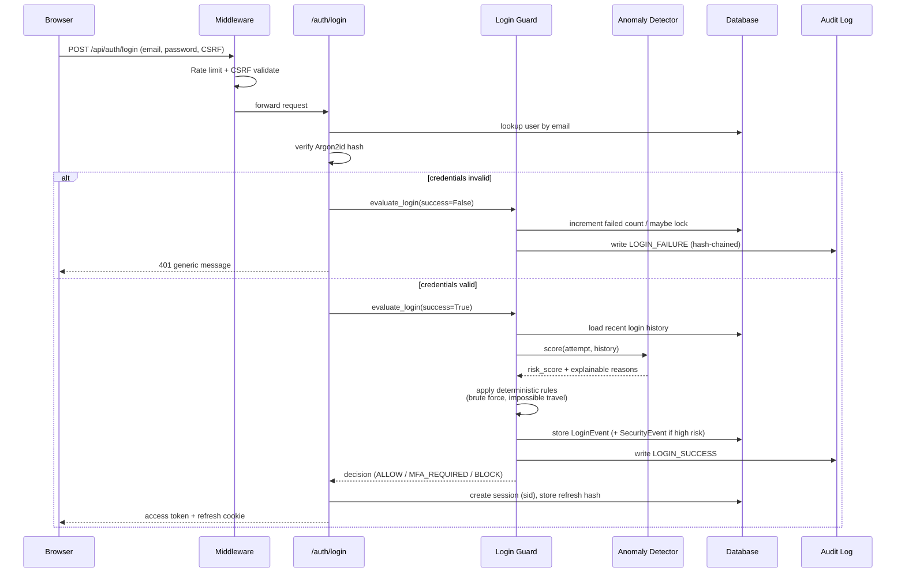
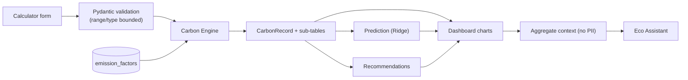
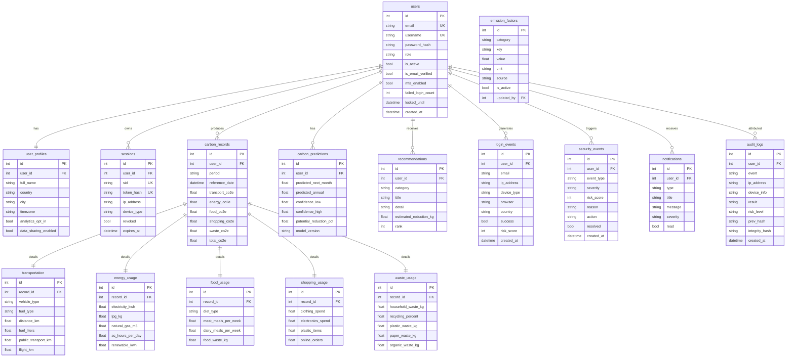

# EcoShield AI — Architecture & Diagrams

This document contains the **system architecture diagram**, **data-flow diagram**,
and **ER diagram** (Mermaid source). Render them in any Mermaid-capable viewer
(GitHub, VS Code "Markdown Preview Mermaid Support", or https://mermaid.live).

---

## 1. System Architecture

**Key principle:** the AI layer never touches the database directly. Services
prepare *aggregate, non-identifying* context and pass it in — a controlled
boundary that limits data leakage and prompt-injection impact.

---

## 2. Data-Flow Diagram (login + risk evaluation)

### Carbon calculation data-flow

---

## 3. ER Diagram

---

## 4. Trust boundaries & threat model (summary)

| Threat | Mitigation |
| --- | --- |
| Credential brute force | Rate limiting + failed-login counter + account lockout + AI/deterministic risk scoring |
| Credential stuffing | Per-IP failure tracking, anomaly detection, generic error messages (no user enumeration) |
| Session hijacking | Short-lived JWT access tokens, server-side revocable sessions, HttpOnly SameSite refresh cookie |
| CSRF | Double-submit CSRF cookie + `X-CSRF-Token` header on all unsafe methods |
| XSS | JSON responses, CSP, `X-Content-Type-Options`, output sanitisation helpers |
| SQL injection | SQLAlchemy parameterised queries throughout (no string-built SQL) |
| Broken access control | Role-Based Access Control dependencies on every privileged route |
| Data leakage via AI | AI receives only aggregate, non-PII context through a service boundary |
| Prompt injection | User text sanitised, length-bounded, wrapped as untrusted data for the LLM path |
| Audit tampering | Append-only, SHA-256 hash-chained audit log with a verification endpoint |
| Sensitive data at rest | Argon2id password hashing; tokens stored only as hashes; export excludes secrets |
